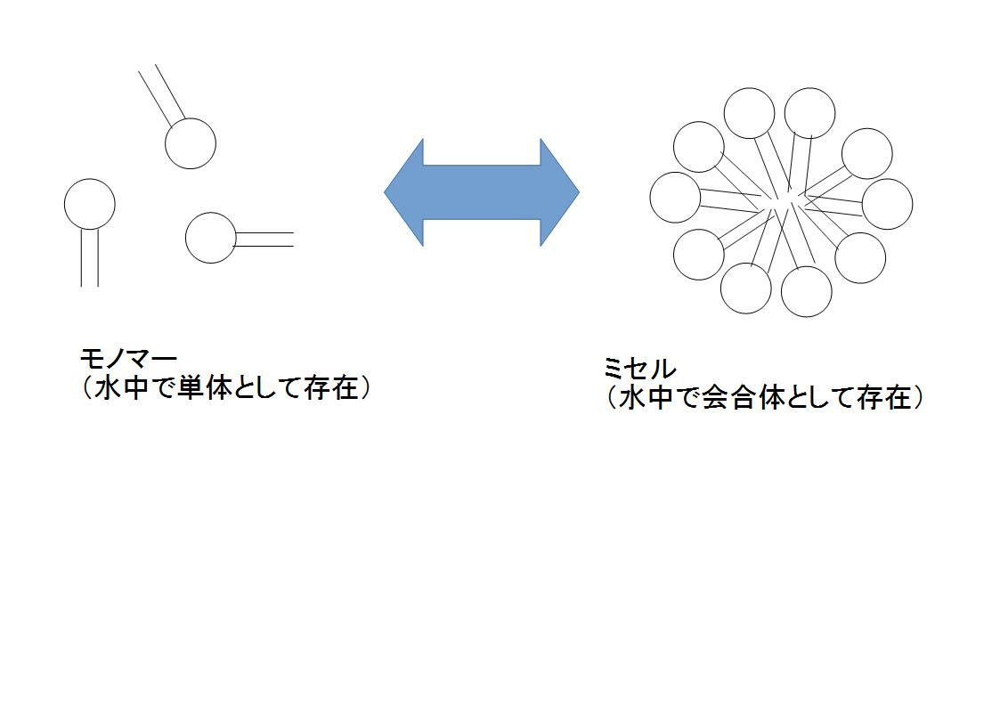
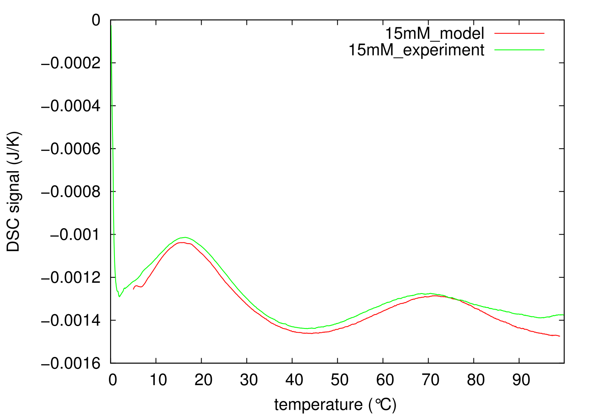
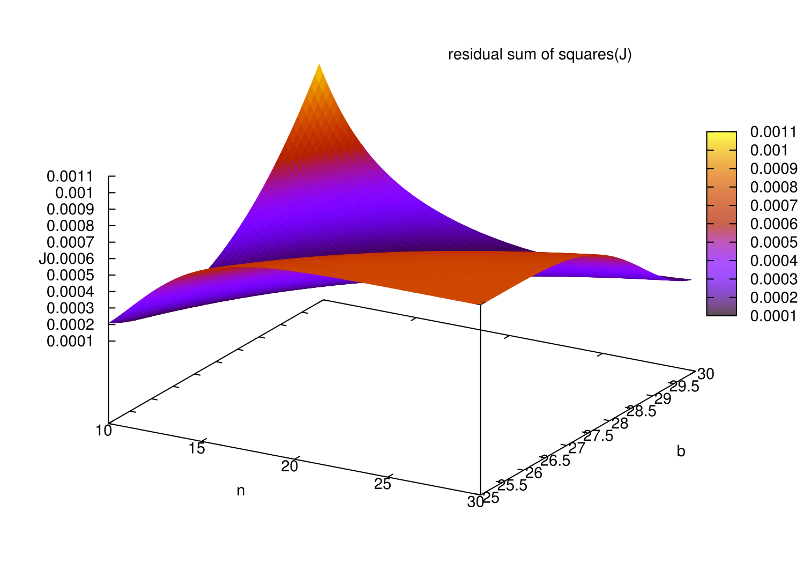
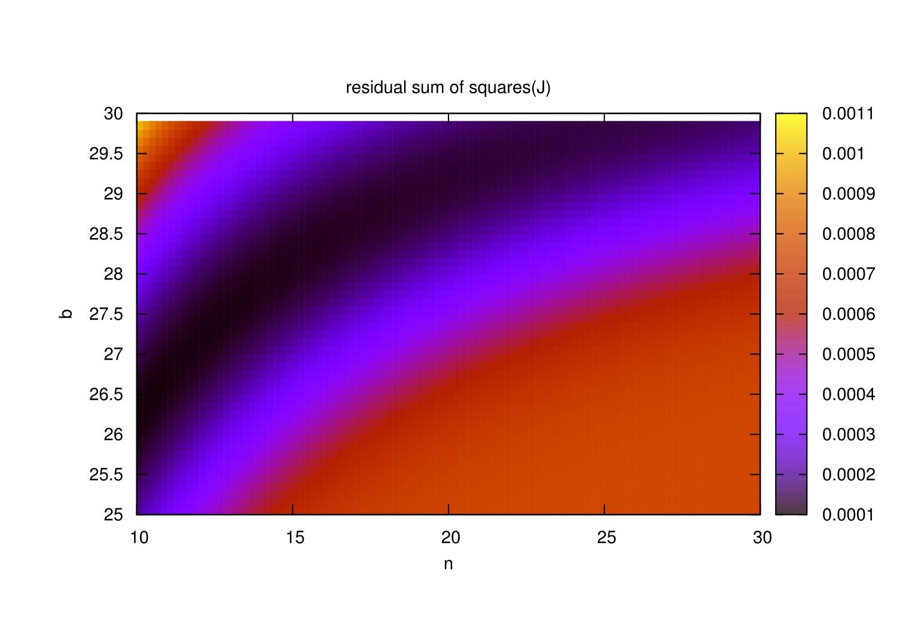
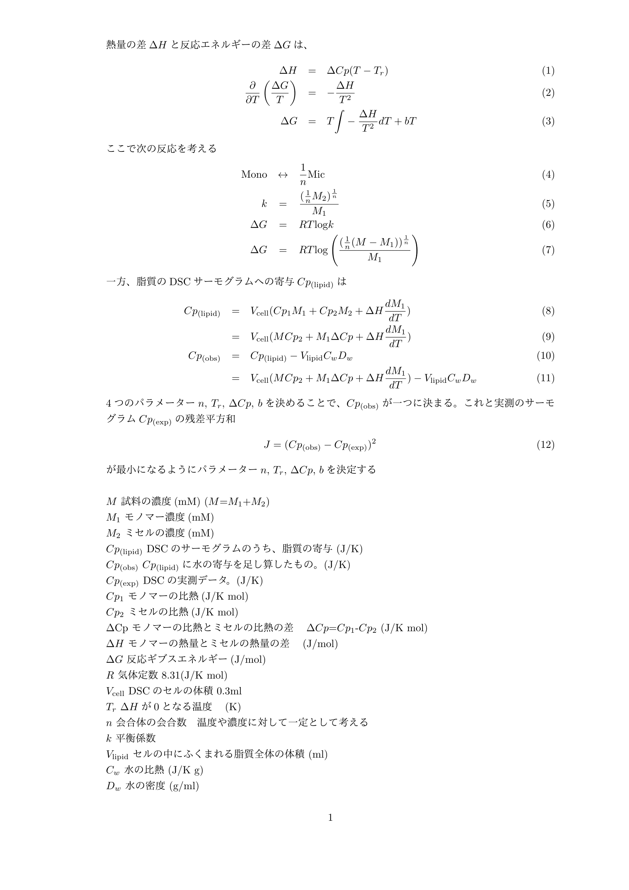

# 熱力学モデル

## 概要
このリポジトリにあるMAFit.cppは、熱力学モデルをC++で実装したものであり、研究用に作成したものです。  
両親媒性分子であるリン脂質は、単独で存在するモノマーの状態と、会合体として存在するミセルの状態の二つを取ります。
この熱力学モデルは、ある量のDHPC(1,2-dihexanoyl-sn-glycero-3-phosphocholine)を水に溶かしたときに、モノマーの量と、ミセルの量がどれだけかを見積もるのが目的です。
比熱を測る装置であるDSC(Differential Scanning Calorimetry)装置から得られた実験データをモデルにあてはめ、一番誤差関数が小さくなるようなパラメータを求めます。  

## リポジトリの内容  
- MAFit.cpp &nbsp;&nbsp;:熱力学モデルをC++で実装したもの  
- MAFit &nbsp;&nbsp;:MAFit.cppをコンパイルしたバイナリーファイル(FreeBSD 10.3-STABLE FreeBSD clang version 3.4.1)  
- MAModel_short.pdf &nbsp;&nbsp;:熱力学モデルの詳細  
- 15mM, 16mM, 18mM, 20mM &nbsp;&nbsp;:それぞれDHPC15mM, 16mM, 18mM, 20mMのDSCの実測データ(mMは濃度の単位で、mM=mmol/lです)  
- monomer, micelle &nbsp;&nbsp;:それぞれモノマーとミセルの熱容量(J/K mol)のデータ  

## 使い方
コンパイルはclang++で  
 
$ clang++ MAFit.cpp -o MAFit  
 
とします。  
 
$ MAFit -h  
 
とすると、使い方を表示させることができます。  
主な使い方は次の通りです。  

### ①パラメーターを入力すると、それに対応したDSCの実測データを出力します。  
例えばDHPC15mMのDSC測定データをモデル計算する場合は次のようにします。  
 
$ MAFit -M 15 -n 20 -Tr 315 -b 29 -Cp1 monomer -Cp2 micelle  
 
-Mは試料の濃度、-n, -Tr, -bはパラメーター(パラメーターの意味についてはMAModel_short.pdfを参照)、-Cp1, -Cp2はそれぞれ、モノマーの比熱、ミセルの比熱を指定しています。パラメーターについては自由に変更することができます。また、比熱については、Cp1, Cp2, dCp（Cp1-Cp2）のうち二つを指定することが必要です。計算に足りないパラメーターがあれば、エラーが出ます。  
計算の詳細を表示した後に、エンターを押すと、標準出力に計算結果を表示します。これをファイルに出力し、gnuplotなどのプロット用ソフトを用いてプロットします。実測のDSCデータに対応する、温度と比熱は、1列目と10列目です。    
 
$ MAFit -M 15 -n 20 -Tr 315 -b 29 -Cp1 monomer -Cp2 micelle > 15mM_model  
$ gnuplot  
gnuplot> plot "15mM_model" using 1:10 with line  
 
また、次のようにすれば、実測とモデルの計算結果を比較することができます。  
gnuplot> plot "15mM_model" using 1:10 title "15mM_model" with line, "15mM" using 1:2 title "15mM_experiment" with line  

### ②DSCの実測データと、パラメーターを動かす範囲を入力すると、パラメーターを動かしながら、誤差関数を計算して出力します。最後に誤差関数が一番小さくなるようなパラメーターを表示します。  

一番実験との誤差を少なくするようなパラメーターを見つけるために、パラメーターを動かしながら、誤差関数を計算していきます。例えば次のようにします。  
 
$ MAFit -M auto 15mM 16mM 18mM 20mM -Cp1 monomer -Cp2 micelle -move n -Tr 315 -move b  
 
-moveオプションで動かすパラメーターを指定します。上では、nとbを動かすパラメーターとして指定し、Trを315に固定しています。また、15mM, 16mM, 18mM, 20mMの4つの実験データを与えて、これとの誤差を計算して5列目に出力していきます。動かすパラメーターの範囲は、-sn, -en, -dn　でパラメーターnの開始、終了、間隔を決めることができます。b, Tr, dCpについても同様です。(-hでヘルプを参照)  

## モデル
以下のようなモデルを実装しています。

  
